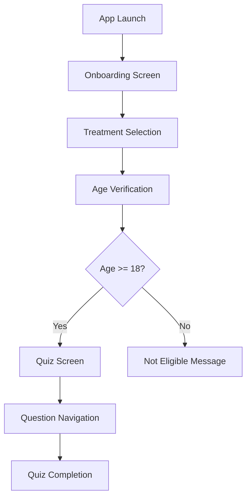

# Design Document

## Overview

The Phoenix Treatment Quiz application is a responsive Flutter web application that provides treatment selection and eligibility assessment. The app follows a clean, minimal design pattern with two primary screens and implements responsive design principles for optimal user experience across all devices.

## Architecture

### Application Structure
```
lib/
├── main.dart                 # App entry point
├── models/
│   ├── treatment.dart        # Treatment data model
│   └── quiz_question.dart    # Quiz question data model
├── screens/
│   ├── onboarding_screen.dart # Treatment selection screen
│   └── quiz_screen.dart      # Quiz interface screen
├── widgets/
│   ├── treatment_card.dart   # Reusable treatment card widget
│   ├── quiz_header.dart      # Phoenix header component
│   └── answer_button.dart    # Quiz answer button widget
├── data/
│   └── quiz_data.dart        # Quiz questions data
└── utils/
    ├── responsive.dart       # Responsive design utilities
    └── age_validator.dart    # Age verification logic
```

### Navigation Flow


## Components and Interfaces

### 1. Treatment Model
```dart
class Treatment {
  final String id;
  final String name;
  final String imagePath;
  final List<QuizQuestion> questions;
}
```

### 2. Quiz Question Model
```dart
class QuizQuestion {
  final String id;
  final String question;
  final List<String> options;
  final String? correctAnswer; // Optional for assessment
}
```

### 3. Responsive Design System
- **Desktop (>1200px)**: 5-column treatment grid, horizontal answer layout
- **Tablet (768-1200px)**: 2-3 column treatment grid, 2-column answer grid
- **Mobile (<768px)**: 1-2 column treatment grid, vertical answer stack

### 4. Screen Components

#### Onboarding Screen
- Responsive treatment card grid
- Treatment selection navigation
- Clean, minimal layout with proper spacing

#### Quiz Screen
- Phoenix header with branding
- Question display area
- Responsive answer options
- Navigation controls (Previous/Next)

## Data Models

### Treatment Data Structure
```dart
final List<Treatment> treatments = [
  Treatment(
    id: 'erectile_dysfunction',
    name: 'Erectile Dysfunction',
    imagePath: 'assets/doctor.png',
    questions: erectileDysfunctionQuestions,
  ),
  // ... other treatments
];
```

### Quiz Questions Structure
Each treatment will have its own comprehensive question set:
- Erectile Dysfunction: 10-15 questions
- Weight Loss: 10-15 questions  
- Hair Loss: 10-15 questions
- Premature Ejaculation: 10-15 questions
- Testosterone Booster: 10-15 questions

## Error Handling

### Age Verification
- Input validation for date format
- Age calculation error handling
- Clear messaging for ineligible users

### Navigation
- Graceful handling of back navigation
- State preservation during quiz progression
- Error recovery for invalid states

### Responsive Layout
- Fallback layouts for edge cases
- Graceful degradation on small screens
- Performance optimization for web deployment

## Testing Strategy

### Unit Tests
- Age validation logic
- Quiz navigation state management
- Responsive breakpoint calculations
- Data model validation

### Widget Tests
- Treatment card interactions
- Quiz answer selection
- Navigation flow testing
- Responsive layout verification

### Integration Tests
- End-to-end user flow
- Cross-device compatibility
- Firebase deployment validation

## Performance Considerations

### Code Optimization
- Minimal widget rebuilds
- Efficient state management
- Lazy loading of quiz questions
- Optimized asset loading

### Web Performance
- Code splitting for faster initial load
- Image optimization
- Minimal bundle size
- Progressive web app capabilities

## Firebase Deployment

### Build Configuration
- Flutter web build optimization
- Asset optimization for web
- Environment-specific configurations

### Hosting Setup
- Firebase hosting configuration
- Custom domain setup (optional)
- SSL certificate management
- Performance monitoring

## UI/UX Design Principles

### Visual Design
- Phoenix branding with dark blue header (#1a237e)
- Clean, minimal interface
- Consistent spacing and typography
- Accessible color contrast

### Interaction Design
- Intuitive navigation patterns
- Clear visual feedback for selections
- Smooth transitions between screens
- Touch-friendly button sizing

### Responsive Design
- Mobile-first approach
- Flexible grid systems
- Scalable typography
- Adaptive image sizing